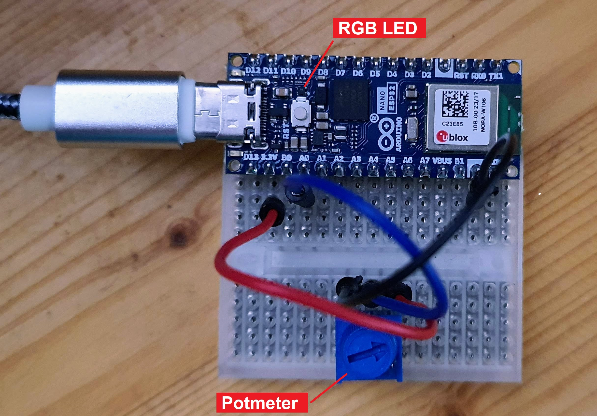
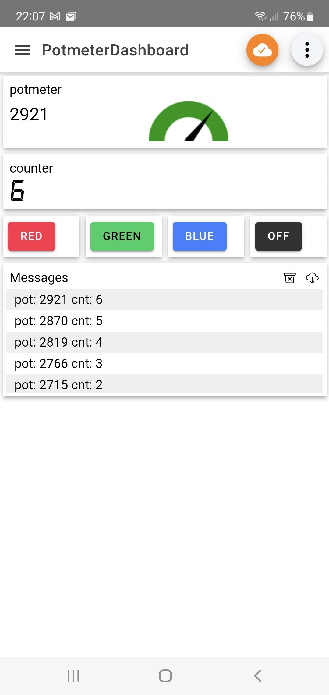

# MQTTtrial
Connecting and ESP32 with an Android app via an MQTT broker

## Setup

Board
- The "IoT" board is an Arduino Nano ESP32, but I believe any ESP will do.
- The board has a potmeter between GND and 3V3, and the slider on A0.
- The board has and RGB led connected to three GPIO pins (that is standard on the Nano ESP32).
- I have written Arduino [firmware](mqtt)

MQTT broker
- The board sends MQTT messages to an MQTT broker.
- I used [test.mosquitto.org](test.mosquitto.org) as test broker.
- It is free, and I used no account, so anybody who knows the topic names can see/spoof them.

MQTT client
- As an MQTT client I used [IoT MQTT panel](https://play.google.com/store/apps/details?id=snr.lab.iotmqttpanel.prod).
- In the app create a dashboard (connection name is up to you, client id is left blank, broker is test.mosquitto.org, port is 1883, network is TCP).
- Add eg a gauge and fill out MCPmqtt1POT (see #define below) as topic name.
- Add eg a text log and fill out MCPmqtt1CNT (see #define below) as topic name, single payload, digital display.
-  Add eg a button and fill out MCPmqtt1BUT (see #define below) as topic name, and red as payload, make the button color red.

## Application

ESP to phone
- When changing the potmeter, its new value is posted to the MQTT broke (as a _topic_ with key "MCPmqtt1POT").
- Since the Android app is subscribed to that topic, it gets notified and update its gauge.
- As bonus, the number of potmeter changes is recorded ('counter") and that is also posted (topic "MCPmqtt1CNT").
- Finally there is a text topic "MCPmqtt1MSG" that contains a text message with the potmeter value and the counter value.

Phone to ESP
- The phone also updates a topic, "MCPmqtt1BUT".
- The value is one of these strings `red`, `green`, `blue`, or `off`.
- The ESP32 is subscribed to this topic and uses the message content to control its on-board RGB led.

## Photos

(end)
